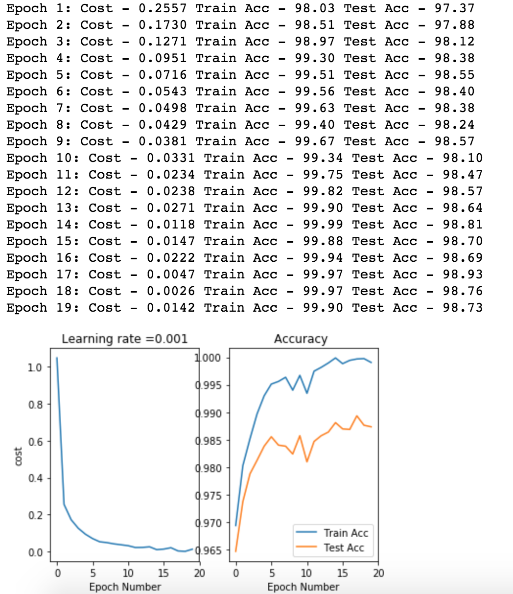

ConvNet Architectures and Examples 
============
<br><br>
## 1. Sample Testing for Convolution and Maxpooling layer

Datasets Source : https://pixabay.com/p-300572/?no_redirect 


<br>
<br>

 

Resized to 200x200 <br>
<br>
* Sample Testing for Convolution and Maxpooling layer <br>
https://github.com/giallo41/Data_Science/blob/master/ConvNet/tf_rgb_cnn_pooling_test.ipynb

* For Deep Understanding follow the link <br>
: Karpathy Stanford Univ cs231n Lecture <br>
http://cs231n.github.io/convolutional-networks/

<br><br><br>
## 2. MNIST dataset Classification using CNN

* Datasets Sources : https://www.kaggle.com/c/digit-recognizer/data


* Jupyter File : https://github.com/giallo41/Data_Science/blob/master/ConvNet/tf_cnn_mnist_1020.ipynb

### Tensor Graph <br>
<Br>

<b>Layer Structure</b> <br>
```
- Input layer : Data shape = [ None, 28, 28, 1] <br>
- Conv1 layer : Filter 3x3 D32, Stride 1 <br>
- Conv2 layer : Filter 3x3 D64, Stride 2 <br>
- Pool1 layer : 2x2 (Max pooling) D64 <br>
- Fully Connected layer : 7*7*64 = 3136 (1-D layer) => 64 <br>
- Output Layer : 10 (softmax - classification ) <br> 
```
<br><br>

* Cost & Accuracy Result 

 

<br>
<br>
<br>

