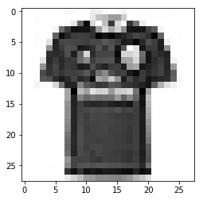

Fashion MNIST Datasets recognition

============
Datasets Source : https://www.kaggle.com/zalando-research/fashionmnist/data

* Title: German Credit data

* Number of Instances: 60,000(train) 10,000(test)

* Number of Classes: 10

* Target : 
CLASSES = {  
    '0': 'T-shirt/top', 
    '1': 'Trouser', 
    '2': 'Pullover', 
    '3': 'Dress', 
    '4': 'Coat', 
    '5': 'Sandal', 
    '6': 'Shirt', 
    '7': 'Sneaker', 
    '8': 'Bag', 
    '9': 'Ankle boot' 
} 
 
 
 
Label : Pullover  

—
1st Edition (09/25)
-------------

> Using Tensorflow 
: Layers = [ 784, 100, 100, 10 ] 

: Relu -> Relu -> Softmax 

: AdamOptimizer 

: learning-rate : 0.001

: Epoch Num : 30

: Training Result 

Epoch 25: Cost - 0.3133 Train Acc - 88.59 Test Acc - 86.66 
Epoch 26: Cost - 0.3119 Train Acc - 88.70 Test Acc - 86.41 
Epoch 27: Cost - 0.3100 Train Acc - 88.41 Test Acc - 86.24 
Epoch 28: Cost - 0.3082 Train Acc - 88.45 Test Acc - 86.49 
Epoch 29: Cost - 0.3064 Train Acc - 89.09 Test Acc - 86.78 
 
 
