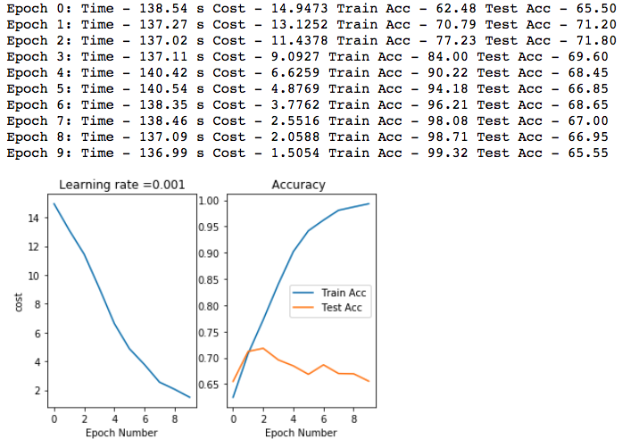

Cats and Dogs Classification 
============
<br><br>
## 1. Sample Testing for Convolution and Maxpooling Simple layer

Datasets Source : https://www.kaggle.com/c/dogs-vs-cats
<br>
Split the Train Data : 23000 - train, 2000 valid <br>
each datasets has exact same labels 50%-Dogs, 50%-Cats <br>
each image has different resolution & scale -> resized image scale 128x128 <br>

<b>Model(1129) Layer Structure</b> <br>
```
- Input layer : Data shape = [ None, 128, 128, 3] <br>
- Conv1 layer : Filter 5x5 D512, Stride 2 <br>
- Pool1 layer : Max pool 2x2 strides 2 <br>
- Fully Connected layer : 32*32*512 (1-D layer) => 64 <br>
- Output Layer : 1 (sigmoid - classification ) <br> 
- Loss ft : Cross Entrophy 
```
<br><br>

<br>
<br>

 
<br><br><br>

* After 10 epoch, showed significant overfitting result <br>

 

<br>
<br>
<br>

