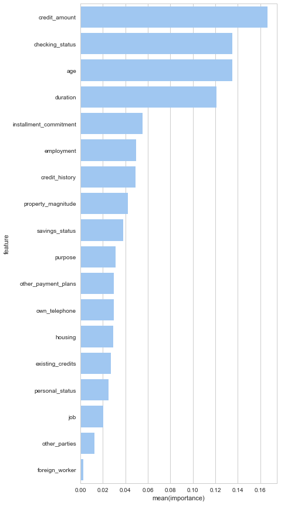

German Credit Datasets analysis
============
Datasets Source : https://www.openml.org/d/31 

* Title: German Credit data

* Number of Instances: 1000

* Number of features: 20

* Target : Good / Bad (70%/30%) 

 : Base Accuracy rate should be above 70% (random choice)

—
2nd Edition (09/17)

> Feture Engineering 
=> Set Small size sample of features -> consolidate & resizing 

> Selected Feature 

 

> Cross Validation Result 
using RandomForest Classifier 

{'criterion': 'gini', 'max_depth': 7, 'max_features': 3, 'n_estimators': 100}
best cross score : 0.765 
test score : 0.755 
Much reduced variance (train & test score) 
but still has a lot of room to improve "Bias" 

—
1st Edition (09/13)

> Feature Selection from 

: DecisionTreeClassifier (1)

: RandomForestClassifier (2) and SelectFromModel 

> Selected Features 

 

> Cross Validation Result 

{'criterion': 'gini', 'max_depth': 8, 'max_features': 1, 'n_estimators': 300}  
best cross score : 0.76125  
test score : 0.72  

