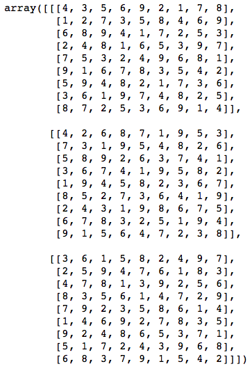

Sudoku Problem solving using neural networks
============
  
## 1 million numpy array pairs of Sudoku games and solutions

Datasets Source : https://www.kaggle.com/bryanpark/sudoku

  

* Sudoku Problem Sample

 

 
fill the 0 with the right number 
 
* play the game  
http://www.sudoku.com/ 

* Target Array (Solutions) 

 
